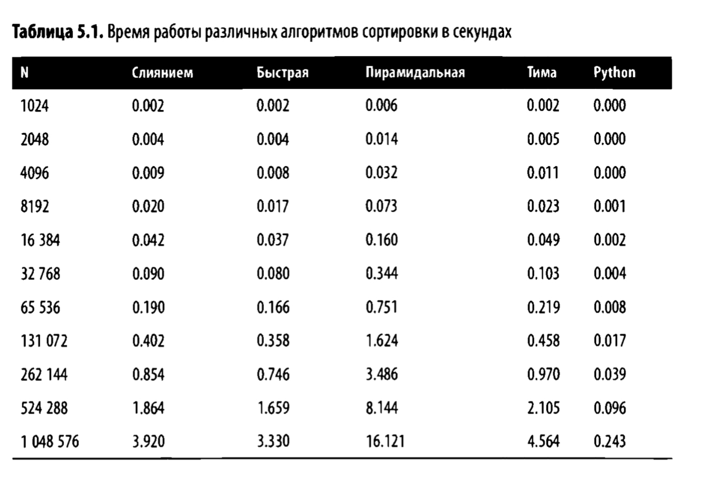

Тестовое задание для компании Lesta Games

Для ознакомления с заданием, прочтите файл TASK.md
В данном файле приведены ответы и комментарии

### Вопрос 1 (файл task1.py)

Базовая функция:

    def isEven(value):
        return value % 2 == 0

Главные плюсы:
1) Простота и лаконичность
2) Алгоритмическая простота и высокая скорость

Главные минусы:
1) Полное отсутствие валидации входных данных
2) Отсутствие описания типов входных и возвращаемых данных
3) Отсутствие описания функции. Хотя тут функционал настолько очевиден, что данный пункт спорен.

Моя функция is_even использует побитовый оператор для определения чётности
Если не считать включённую в функцию базовую валидацию, то время выполнения подобного алгоритма,
а также затраты по памяти составляют О(1)

Главные плюсы:
1) Добавлена базовая валидация входных данных
2) Добавлено описание типов входных и возвращаемых данных
3) Добавлено описание функции.

Главные минусы:
1) Валидация добавляет сложности функции
2) Процесс валидации потребляет определённое количество ресурса

Также мне понравилась идея преобразования числа в строку и проверки на чётность только
последней цифры.
Думаю, что это может быть полезно, если вводные цифры очень велики.
Для этого создана функция is_even_for_large_numbers
Если не считать включённую в функцию базовую валидацию, то время выполнения подобного алгоритма,
а также затраты по памяти составляют O(len(str(number))

Главные плюсы:
1) Добавлена базовая валидация входных данных
2) Добавлено описание типов входных и возвращаемых данных
3) Добавлено описание функции.
4) Учтен частный случай

Главные минусы:
1) Валидация добавляет сложности функции
2) Процесс валидации потребляет определённое количество ресурса
3) Сама функция написана для частного случая и имеет весьма посредственную эффективность
при обработке стандартных данных по причине наличия дополнительных преобразований

### Вопрос 2 (файл task2.py)
При выполнении данного задания я реализовал стандартный и асинхронный подход к FIFO классам.

Класс SimpleFIFO является максимально простой и прямолинейной реализацией данного принципа.
Мы просто добавляем что-то в список при вызове метода add и просто получаем самый старый элемент
списка при вызове метода get. 
При желании в данный класс можно добавить и другие методы, например show (отображение всех элементов),
size (отображение количества элементов), flush (удаление всех элементов очереди и т.д.).

Но я хотел сделать данный класс максимально простым, что, надеюсь, получилось.

С другой стороны, класс AsyncFIFO реализует насколько можно более простой способ применить 
асинхронность к FIFO. Мы иницализируем класс очередью. Я ограничил её для большей наглядности.
В данном случае метод add добавляет элементы, если есть для них место (если нет, то он ждёт, когда это место появится), 
а метод get получает самый старый элемент,
если он конечно же есть в очереди (size > 0). Оба метода являются корутюнами. В класс также могут быть добавлены
другие методы, но я решил ограничиться этими.

Конечно же для тестирования этого класса нужен producer и consumer для генерации и потребления задач,
но задание не предусматривает их написания.

В реализацию обоих классов можно добавить механизмы валидации данных и перехвата исключений.

Плюсы SimpleFIFO:
1) Простота и понятность
2) Может работать быстрее при некоторых условиях благодаря своей линейности и независимости методов

Минусы SimpleFIFO:
1) Очевидно не может выполнять несколько тасков одновременно. При определённых остоятелствах, это может обусловить
производительность.
2) Менее гибкая система, по моему мнению

Плюсы AsyncFIFO:
1) Имеет преимущество в случае необходимости использования свободных ресурсов в процессе выполнения других процессов одновременно
2) Более гибкая и организованная структура

Минусы AsyncFIFO:
1) Меньшая производительность при простых и линейных задачах по сравнению с SimpleFIFO
2) Асинхронность сложнее для понимания и требует определённых, более продвинутых, знаний, если сравнивать с линейным подходом.

### Вопрос 3 (файл task3.py)

Не смотря на то, что я не производил замеры самостоятельно, считаю книгу "Алгоритмы на Python"
автора Джорджа Хайнемана достаточно авторитетным источником, чтобы утверждать,
что наилучшим решением при сортировки указанного массива будет встроенные функции sort \ sorted.

Каковы мои аргументы в пользу этого и почему я считаю данный вид сортировки (оптимизированная сортировка Тима)
лучше быстрой сортировки (qsort)?

Функция sort является встроенной функцией Python и написана на языке С. 
Это означает, что она существеннее быстрее любой функции сортировки, написанной
на языке Python. 

К тому же, алгоритм быстрой сортировки подразумевает использование рекурсии,
а это означает как большую сложность алгоритма, так и большую вероятность
возникновения ошибок.

Если говорить про конкретные значения в миллисекундах,
то ниже приведена таблица из вышеуказанной книги.

Однако, если рассматривать самый быстрый алгоритм сортировки, написанный на Python,
то конечно же быстрая сортировка (qsort) будет быстрее своих конкурентов. Это видно из той же таблицы.
В файле task3.py приводятся обе функции сортировки.

